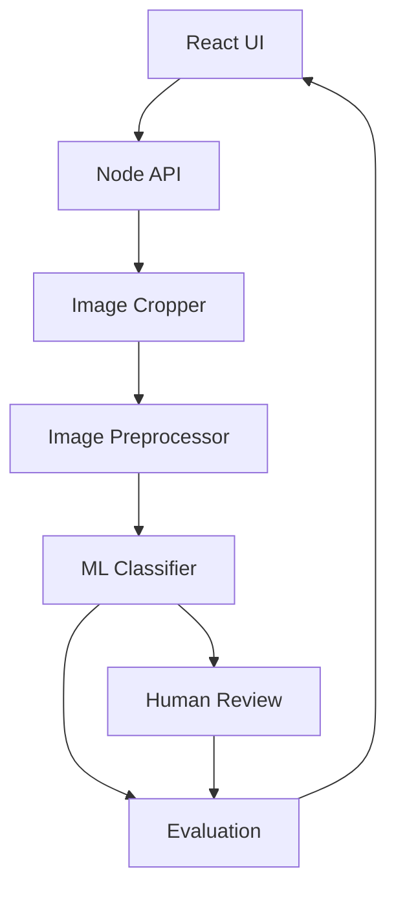
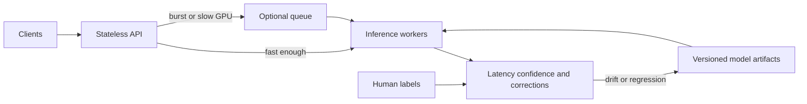

# Computer Vision Image Classification Lab

A local TypeScript application for benchmarking image classification. You upload an image, the server divides it into a 3×3 or 4×4 grid, preprocesses each region, and runs those regions through a pretrained MobileNet model in one batch. The page shows the predicted category, confidence, and latency. You can confirm or correct uncertain predictions and then measure precision, recall, and F1 against your labels.

This is an analysis tool. A prediction never triggers an external action.

## Quick start

Requirements: Node.js 20 or newer.

```bash
npm install
npm run model:download
npm run dev
```

Open http://localhost:3000.

In a second terminal, with the server already running:

```bash
npm run benchmark
```

Other checks:

```bash
npm run typecheck
npm run lint
npm test
npm run build
NODE_ENV=production npm start
```

`npm start` serves the built client from `dist/client` and expects `npm run build` first. `npm run dev` serves the Vite client and the API together on port 3000.

The first model load downloads MobileNet v2 0.50 (about 8 MB of weights) from TensorFlow Hub into `models/mobilenet/` and caches it there. Later starts load that copy from disk. The lab does not fetch images from the network.

## 1. Problem statement

Grid-level image classification is a useful way to measure a vision pipeline: how regions are cut, how they are prepared for a network, how long inference takes, and how often a human agrees with the model.

The lab answers a narrow question. Given one local image and a chosen grid, what category does the model assign to each cell, how confident is it, and how does that compare with a human correction?

The category set is ordinary visual classes: car, bicycle, bus, motorcycle, traffic-light, tree, and building. The model may also return `other` when the ImageNet probability mass does not land in that set.

## 2. Architecture



The browser is only a client. React components collect a file, a grid size, and a target class, then render results. They do not run the model.

Express exposes `POST /api/analyze`, `POST /api/evaluate`, `GET /api/health`, and `GET /api/dataset`. The analyze route validates the upload, then calls independent modules:

| Module | Responsibility |
| --- | --- |
| `src/image/imageLoader.ts` | Magic-byte detection, dimension limits, RGB decode, previews |
| `src/image/imageCropper.ts` | Exact grid partition |
| `src/image/imagePreprocessor.ts` | Sharp resize and optional adjustments |
| `src/image/imageQuality.ts` | Blur, contrast, brightness, and size signals |
| `src/ml/modelLoader.ts` | Load-once model manager |
| `src/ml/tensorflowClassifier.ts` | TensorFlow.js batch inference |
| `src/ml/labelMap.ts` | ImageNet label to lab category |
| `src/ml/prediction.ts` | Prediction schema and confidence bands |
| `src/evaluation/metrics.ts` | Precision, recall, F1, confusion matrix |
| `src/evaluation/dataset.ts` | Mock or local dataset splits |
| `src/automation/benchmarkRunner.ts` | Puppeteer run against this local app |

Structured logs look like:

```json
{"event":"image_analysis","regionCount":9,"preprocessingMs":14,"inferenceMs":82,"totalMs":103}
```

Image bytes are never written to the log.

## 3. Why computer vision?

The input is a picture, not a table of numbers. The useful signal is spatial: edges, color, texture, and parts of objects. Classical feature engineering can describe some of that, but a convolutional network already compresses those patterns into features that transfer across photos. The lab makes each stage visible so you can see where time goes and where the model is unsure.

## 4. Why machine learning?

Rules such as "a red blob is a car" fail as soon as lighting, crop, or viewpoint changes. A model trained on many photos learns a decision surface over pixels. The cost is that the decision is probabilistic and can be wrong, so the product needs confidence, human review, and metrics that are not just accuracy.

## 5. Why transfer learning?

MobileNet v2 was trained on ImageNet. Its early layers already detect edges, corners, and textures. Training a deep network from scratch for seven classes would need a large labeled set and a long training run, and it would still be worse than a model that has already seen a million images.

This lab keeps the pretrained classification head and maps ImageNet class probabilities onto the seven lab categories. That is transfer of a trained representation, not a new training run. A production version would replace the mapping with a small softmax trained on labeled regions, while freezing or lightly fine-tuning the backbone. The mapping lives in `labelMap.ts`, so that swap stays local.

## 6. CNN vs Vision Transformer

A convolutional network applies small filters across the image. Translation equivariance and local receptive fields are strong inductive biases, which is why a compact CNN such as MobileNet works well at 224×224 and can run on CPU.

A Vision Transformer cuts the image into patches and mixes them with attention. With large-scale pretraining it can model long-range relationships, but it is heavier, more data-hungry, and a poor default for a nine-tile CPU benchmark.

For this lab the backbone is MobileNet v2 with width multiplier 0.50 and a 224×224 input. The graph's batch dimension is dynamic, so a 3×3 or 4×4 grid is one forward pass.

## 7. Classification vs object detection

Classification assigns one label to a whole crop. Object detection returns boxes and labels inside an image. Semantic segmentation labels pixels.

This lab classifies each grid cell. That is the right measurement for "what is this region mostly?", and the wrong measurement for "where is the object?". A car split by a grid line can be missed or split across two cells. Two objects in one cell become a single label. Detection or segmentation would be the next model if the product needed locations. The grid is a region sampler for the benchmark, not a detector.

## 8. Image preprocessing

The pipeline is:

```text
Image
  -> grid configuration
  -> crop regions
  -> preprocess
  -> batch inference
  -> predictions and confidence
  -> optional human review
  -> precision, recall, F1
```

Resize to the network's input size is required. For non-square cells, resize uses `fill`, which keeps every source pixel and stretches the cell to a square. Cover-crop would drop pixels. Letterboxing would add a border the network never saw in training. Stretching changes geometry, which is an acceptable bias for a benchmark and a documented one.

These steps are off unless configured:

- `normalize`: Sharp histogram stretch. It is not the same thing as dividing pixels by 255. The classifier always scales pixels into the model's `[0, 1]` input range itself.
- `sharpen`: a mild unsharp mask (`sigma` 0.6).
- `contrast`: a linear slope around mid-gray, limited to 0.5–2.

Excessive sharpening creates halos and amplifies sensor noise and compression artifacts. Those patterns were not in the training photos, so the model can treat them as evidence. Denoising, which this lab does not apply, removes texture that may be the only clue for a class, and it cannot invent edges that blur destroyed. Low-quality inputs are flagged. They are not "fixed".

## 9. Confidence scoring

MobileNet returns 1,000 logits. The classifier applies softmax, then sums the probability of every ImageNet class that maps to a lab category. Whatever does not map becomes `other`.

```json
{
  "predictedClass": "car",
  "confidence": 0.942,
  "probabilities": {
    "car": 0.942,
    "bus": 0.031,
    "bicycle": 0.014,
    "tree": 0.013
  }
}
```

Confidence is that summed probability, not a second softmax over only the seven names. Renormalizing would force an unrelated photo to look certain. Bands:

| Confidence | Band |
| --- | --- |
| ≥ 0.90 | HIGH CONFIDENCE |
| 0.60 – 0.90 | UNCERTAIN |
| < 0.60 | LOW CONFIDENCE |

`other` and `unknown` always ask for review, even if the numeric confidence is high, because they are outside the lab taxonomy.

## 10. Human-in-the-loop

Each region stores:

- `modelPrediction`: the class the network chose
- `humanPrediction`: null until you confirm or change it
- `finalPrediction`: the human label after review, otherwise the model label

Confirm keeps the model class. Change Class replaces it. Evaluation treats the human label as ground truth and the model label as the prediction. Confirming a wrong class on purpose will inflate the score. That is a real review-process risk, not a hidden feature.

The page does not click, navigate, or submit a result anywhere except this API.

## 11. Batch inference

Nine regions become one tensor of shape `[9, 224, 224, 3]` and one `predict`. Sixteen regions become `[16, 224, 224, 3]`. The model stays loaded.

One fused pass avoids nine separate kernel launches and nine trips through the JavaScript/native boundary. Average region latency is inference time divided by the region count. That number is smaller than the wall time of one region, because the regions shared the pass. It is not a promise that nine independent requests would each be that fast.

On CPU the gain is real but limited by memory bandwidth. On a GPU the same batch hides launch overhead until the device is full. If this checkpoint rejects a batch, the classifier falls back to one region at a time on the same in-memory model and logs `inference_fallback`. It does not reload the model.

## 12. Performance

Timings are returned on every analysis:

- crop time
- preprocessing time
- inference time, including tensor build and the forward pass
- preview encoding
- quality analysis
- total wall time
- average region latency

`npm run benchmark` drives the local page with Puppeteer, reads those figures, and writes `reports/benchmark-report.json` plus a screenshot.

Measured on this workstation (CPU, TensorFlow.js, MobileNet v2 0.50, 3×3 synthetic image, model already warmed):

| Stage | Time |
| --- | --- |
| Preprocessing | 12.2 ms |
| Batch inference, 9 regions | 3798.9 ms |
| Pipeline total | 3845.6 ms |
| Average region latency | 422.1 ms |
| Browser click to results | 3913 ms |

On the synthetic street drawing, all 9 regions were classified as `other` (confidence about 0.93–0.99). That is the expected result for clip-art that does not match ImageNet photographs. `tree` stayed at 0 because ImageNet-1k has no generic tree class in the label map. This run measures the pipeline, not accuracy.

Synchronous inference is appropriate while a batch finishes well under a normal HTTP timeout and concurrency is modest. A queue becomes useful when GPU work must be shared, bursts would time out HTTP connections, or retries should happen off the request thread. For a single local user and a sub-second or few-second CPU batch, a queue would add a broker, job IDs, and polling without making the result more correct.

## 13. Security

- Maximum upload size defaults to 8 MB (`MAX_UPLOAD_BYTES`).
- MIME type comes from magic bytes, not the browser's content type.
- The extension must match those bytes (`.png`, `.jpg`, `.jpeg`, `.webp`).
- File names containing `..`, slashes, or nulls are rejected. The upload stays in memory. The original name is never used as a path.
- Width and height are capped (`MAX_IMAGE_DIMENSION`, default 8192). Sharp's pixel limit rejects decompression bombs.
- Grid axes must be integers from 1 to 4 on the API. The UI offers 3×3 and 4×4.
- There is no endpoint that fetches a remote image URL.
- Dataset files must stay inside `DATASET_DIR` after `realpath`, so a symlink cannot escape the root.
- Model weight paths in the manifest must stay inside the model directory.
- The benchmark runner only opens `localhost`, `127.0.0.1`, or `::1`.

## 14. Testing

```bash
npm test
```

Coverage includes:

1. 3×3 cropping, including a full pixel reconstruction
2. 4×4 cropping
3. Odd dimensions and non-square images
4. Preprocessing, including rejected extreme contrast
5. Prediction schema
6. Confidence bands and review flags
7. Precision
8. Recall
9. F1
10. Confusion matrix
11. API validation for empty, corrupt, unsupported, oversized, and invalid grids
12. A Puppeteer flow: open the local app, upload, choose a grid, analyze, read cards, save a report

Also covered: model manager single-flight loading and retry after failure, dataset group splits, image quality flags, and a real MobileNet batch when `models/mobilenet` is present.

## 15. Limitations

- ImageNet has many vehicle classes and almost no generic "tree" or "building" classes. Those two lab labels will rarely win until a new head is trained. `other` is the honest output.
- The head is a label map, not a fine-tuned classifier. Accuracy on synthetic drawings is not a meaningful model score.
- Grid classification is not detection. Objects on boundaries are split.
- TensorFlow.js on CPU is slower than `tfjs-node` or a GPU server. It was chosen so install does not need a native compile.
- Human confirmations are trusted. Rubber-stamping makes the metrics look better than the model is.
- One process holds one model. There is no multi-model router in this repo.

## 16. Scaling strategy

Keep the API stateless apart from the model weights. Scale request processes horizontally, each with a warmed model, or move inference to a shared model server and keep the API thin.

Practical steps, in order:

1. Warm the model at startup, which this app already does, so the first user does not pay compile time.
2. Batch regions from one request, which this app already does.
3. Move the same graph to `tfjs-node` or a GPU runtime if CPU latency is too high.
4. Put the model behind a model server when many API replicas would each need a copy of the weights.
5. Add a queue only when synchronous latency or burst traffic justifies it.
6. Version the model artifact and the dataset snapshot together.
7. Watch latency, error rate, confidence histograms, and the rate of human corrections.
8. Treat a rising correction rate on a class as drift, not as a UI problem.
9. Ship a new model beside the old one, compare them on the same traffic, and roll back by routing to the previous version.

## 17. Production architecture



Model warmup happens when a worker starts, before it takes traffic. Batching can group regions from one image, or, at higher scale, micro-batch regions from several requests for a few milliseconds.

GPU inference helps when the convolutional workload dominates and the card stays busy. It does not fix a bad label map.

Model serving (TensorFlow Serving, Triton, or a small process that only runs `predict`) isolates GPU memory from the web process. The API then sends tensors or image bytes and receives probabilities.

Horizontal scaling is easy while each node can load the model. Past a few replicas, a shared server wastes less GPU memory than one copy per pod.

A queue is unnecessary when p95 inference fits in the HTTP timeout and you do not need to shed bursts. It is necessary when you want backpressure, retries, and fair GPU scheduling.

Model versioning means the artifact, label map, and preprocessing config share an id. Dataset versioning means the train, validation, and test manifests are immutable snapshots. Training and evaluation cite those ids.

Monitoring should include latency breakdown, input quality rate, confidence histogram, per-class correction rate, and data drift on simple image statistics.

Model drift is a change in input photos or in the relationship between photos and labels. The human correction stream is a direct drift signal.

The feedback loop is: store model label, human label, and final label; sample disagreements; fine-tune; evaluate on a sealed test split; ship. Do not add corrected images to the test set.

A/B or shadow traffic compares a candidate model with the current one on the same images. Rollback is a config change back to the previous model id, not a retraining emergency.

## 18. Interview questions

**Why is accuracy not enough here?**
If most regions are cars, a model that always says "car" can score high accuracy and still have zero bicycle recall. Report per-class precision, recall, F1, and a confusion matrix. Macro averages treat each class equally. Accuracy, like a micro average, follows the frequent classes.

**Why load the model once?**
Loading parses the graph and compiles kernels. Doing that per request burns latency and memory and can fail under concurrency. A single-flight `ModelManager` loads once, shares the in-memory graph, and lets a failed load be retried.

**When does batching stop helping?**
When the device is already at its compute or memory limit, when the batch is so small that overhead dominates, or when tail latency matters more than throughput and you cannot wait to fill a batch. A batch of 9 or 16 is about amortizing overhead, not about saturating a GPU.

**Why can sharpening hurt a pretrained model?**
The network's filters expect natural edges. Heavy sharpening adds halos and noise at frequencies that look like texture. The probability can go up for the wrong class. The same is true of aggressive denoising, which deletes the texture the class depended on.

**What is near-duplicate leakage?**
Two crops of one photo, or adjacent video frames, are not independent. If one is in training and one is in test, the model is graded on a picture it has essentially memorized. Split by scene group. A 70/15/15 ratio is applied to groups, and the test groups must be scenes that never appear in training or validation.

**Why is a grid not an object detector?**
A classifier emits one label for the whole cell. It has no box, no instance count, and no notion of an object crossing the cut. Use detection or segmentation when location matters.

**When would you skip a queue?**
When one batch returns quickly enough to hold the HTTP connection, errors can be returned immediately, and traffic does not need to be smoothed. Add the queue when those stop being true.

**How do you roll back a bad model?**
Keep the previous artifact loaded or loadable, route new requests to its version id, and keep the dataset snapshot so you can explain the regression. Do not overwrite the only copy of the weights.

## Dataset

No images are downloaded by the app. `GET /api/dataset` uses `MockDatasetProvider` unless `DATASET_DIR` contains `train/`, `validation/`, and `test/` folders of labeled images. The mock set has 20 scene groups and two views each. Both views of a scene stay in the same split.

For a real training run, CIFAR-10 is an openly documented public classification dataset (small 32×32 images, ten classes). It is not wired in here. A closer label set for cars, bikes, and buses would be a subset of Open Images or COCO, with a scene-level split so frames from one photo stay together. Those datasets are not fetched by this project.

## Configuration

| Variable | Default | Role |
| --- | --- | --- |
| `PORT` | `3000` | HTTP port |
| `MAX_UPLOAD_BYTES` | `8388608` | Upload limit |
| `MAX_IMAGE_DIMENSION` | `8192` | Max width or height |
| `MODEL_DIR` | `models/mobilenet` | Local MobileNet files |
| `DATASET_DIR` | empty | Optional local dataset root |
| `PREPROCESS_WIDTH` / `PREPROCESS_HEIGHT` | `224` | Sharp resize |
| `PREPROCESS_NORMALIZE` | `false` | Histogram stretch |
| `PREPROCESS_SHARPEN` | `false` | Mild sharpen |
| `PREPROCESS_CONTRAST` | `1` | `1` means unchanged |

## Model license

MobileNet v2 weights are Google's ImageNet checkpoint published for TensorFlow.js, under the Apache License 2.0. ImageNet class names come from the TensorFlow.js MobileNet label list, also Apache-2.0.

## Layout

```text
src/image/          load, crop, preprocess, quality
src/ml/             classifier interface, TensorFlow.js, model manager
src/evaluation/     metrics and dataset splits
src/api/            HTTP validation and routes
src/server/         pipeline and process entry
src/client/         React UI
src/automation/     local Puppeteer benchmark
tests/              unit tests and the browser flow
```
